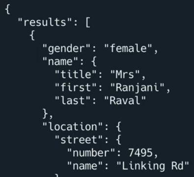
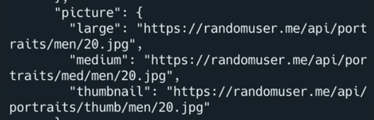

# JSON

It's day 90, and today we're going to start learning how to use **JSON** (java script object notation - pronounced Jason) to get data from other websites. It's the first step on our journey to web scraping.

JSON is a text based way of describing how a 2D dictionary might look. This is important when sending messages to other websites and getting a message back and decoding it. Most of the time, the message we get back will be in JSON format, and we need to interpret it in Python as a 2D dictionary to make sense of it.

## Go Get The Data

👉  Let's do a simple data grab from a free to use website - *randomuser.me* that generates some data about a fictional user.
```python
import requests # import the required library

result = requests.get("https://randomuser.me/api/") # ask the site for data and store it in a variable

print(result.json()) # interpret the data in the variable as json and print it.

```
Run it. You'll get **lots** of data.

## Tidy it up
👉 Next, let's try to tidy that up a bit.

```python
import requests, json #imports the json library

result = requests.get("https://randomuser.me/api/")
user = result.json() #a dictionary containing the user's data
print(json.dumps(user, indent=2)) #outputs the json to the console with an indent to make it more readable.
```
This should format your output a little better, and you should be able to see that it is indeed in dictionary format. The first level dictionary is called `results`.



## Output
👉 Here's the code to output one piece of data about the user. I'm going to output their first and last names.  I've commented out the 'output everything' line of code to focus on the one piece of information output.


```python
import requests, json 

result = requests.get("https://randomuser.me/api/")
user = result.json() 
# print(json.dumps(user, indent=2)) 

name = f"""{user["results"][0]["name"]["first"]} {user["results"][0]["name"]["last"]}""" # Get the first and last names from the results dictionary and assign to a variable

print(name) # output the variable
```
Every time you run the code, it should get a new random user from the site and output their name.

## Pictures, Everybody Needs Good Pictures


If you scrolled down the big json data file, you might have noticed that images were also part of our random user's profile:


👉 Let's get the image as well and let's store it in a local file. Here's the code in isolation:

```python
image = f"""{user["results"][0]["picture"]["medium"]}""" # Get the user's profile picture and assign to a variable, changing 'medium' to 'large' will make the image less pixelated
picture = requests.get(image) #downloads the image
f = open("image.jpg", "wb") # opens the image.jpg file for writing in binary (data of the image will be added to the repl)
f.write(picture.content) #writes the image to the file  
f.close() #closes the file

print(image)
```
👉 And here's all the code:

```python
import requests, json #imports the json library

result = requests.get("https://randomuser.me/api/")
user = result.json() #a dictionary containing the user's data
# print(json.dumps(user, indent=2)) #outputs the json to the console with an indent to make it more readable.

name = f"""{user["results"][0]["name"]["first"]} {user["results"][0]["name"]["last"]}""" # Get the first and last names from the results dictionary and assign to a variable

image = f"""{user["results"][0]["picture"]["medium"]}""" # Get the user's profile picture and assign to a variable, changing 'medium' to 'large' will make the image less pixelated
picture = requests.get(image) #downloads the image
f = open("image.jpg", "wb") # opens the image.jpg file for writing in binary (data of the image is added to the repl)
f.write(picture.content) #writes the image to the file  
f.close() #closes the file

print(image) # output the variable
```

## Loops Loops Loops
👉 We could use a loop to achieve the same thing, but make our code a bit neater and more readable. We only get one user back from this website, but this code would deal with multiple users too.

I've gone back to just outputting the name to simplify the example. Here's the code:
```python
import requests, json

result = requests.get("https://randomuser.me/api/")
user = result.json()
# print(json.dumps(user, indent=2)) 

for person in user['results']: #loops through each person in the results dictionary
  name = f"""{person["name"]["first"]} {person["name"]["last"]}""" #creates a string with the name of the person

  print(name)#prints the name of the person
```

## Try it out!